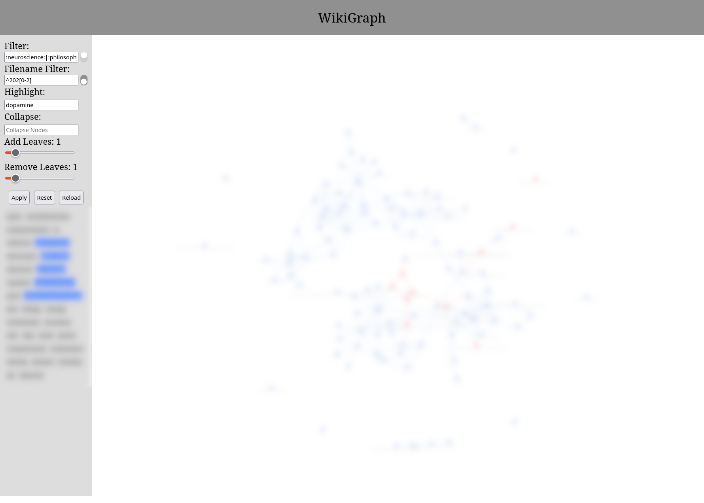

# Introduction
WikiGraph is a Flask web application for visualising [VimWiki](https://github.com/vimwiki/vimwiki) and Markdown wikis.
It creates a directed graph of links between wiki files that affords filtering, highlighting, and structural operations.
Filtering is performed via regular expressions; multiple keywords can be combined with the pipe operator `expr1|expr2`.



# Installation
Clone the repository, run `pip install -e .` and copy `vimwikigraph.sh` to a directory included in your PATH.


# Configuration
The path to the wiki and all options must be specified in a config file pointed to by an environment variable:
```
export VIMWIKIGRAPH_CONFIG=~/path/to/vimwikigraph.cfg
```

A template config file is provided. Available options:

| Option | Default | Description |
|---|---|---|
| `FILE_EXTENSIONS` | `['wiki']` | File extensions to index. Add `'md'` for Markdown support. |
| `DEFAULT_FILTER` | `[]` | Regex list applied to file contents on load. |
| `DEFAULT_INVERT_FILTER` | `False` | Invert the content filter. |
| `DEFAULT_FILE_FILTER` | `[]` | Regex list applied to filenames on load. |
| `DEFAULT_INVERT_FILE_FILTER` | `False` | Invert the filename filter. |
| `DEFAULT_HIGHLIGHT` | `[]` | Regex list for nodes to highlight on load. |
| `DEFAULT_COLLAPSE` | `[]` | List of nodes whose children are collapsed on load. |
| `DEFAULT_REMOVE_LEAVES_DEPTH` | `0` | Number of leaf layers to strip on load. |
| `DEFAULT_ADD_LEAVES_DEPTH` | `0` | Number of leaf layers to restore on load. |
| `EXCLUDE_TAGS` | `[]` | Tags to hide from the tag browser. |
| `N_TAGS` | `30` | Maximum number of tags shown in the tag browser. |
| `SEPARATOR` | `';'` | Delimiter for multiple values in filter fields. |

# Sidebar controls

| Control | Description |
|---|---|
| Filter | Regex matched against file contents. Nodes not matching all expressions are removed. |
| Filename Filter | Regex matched against filenames. |
| Highlight | Regex matched against file contents. Matching nodes are coloured red. Updates live as you type. |
| Collapse | Whitespace-separated list of nodes whose children are contracted into them. |
| Add Leaves | Restore this many layers of nodes from the original graph outward. |
| Remove Leaves | Strip this many layers of leaf nodes (out-degree 0). |
